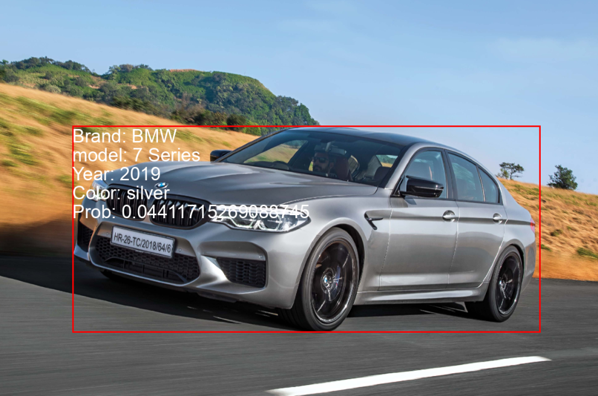
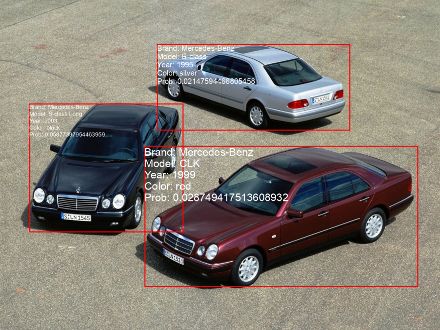
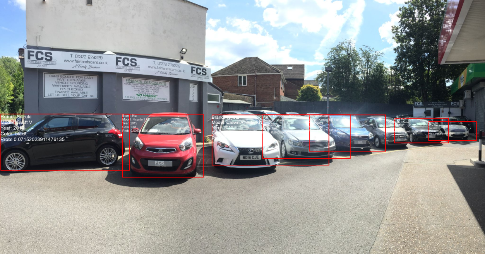

# Car Detector AI 🚗🔍

Car Detector is a SOTA car extraction and classifier it uses multiple models in a pipeline to detect, extract and classify cars.

# How to use

* Navigate to the project directory: `cd ./detector`

* Install dependencies: `pip install -r requirements.txt`

* Download and put models in `detector/models` (model.pkl for brand and color.pkl for color)

* Define environement variables in a file: `MODEL='model.pkl_path'` and `COLOR='color.pkl_path`

* Run `source ../actenv` to activate environement variables to be used by the shell

* Launch the api: `uvicorn main:app --reload`

* Navigate to `127.0.0.1:8000`

# Examples

* Example 1:

* Example 2:

* Example 3:

